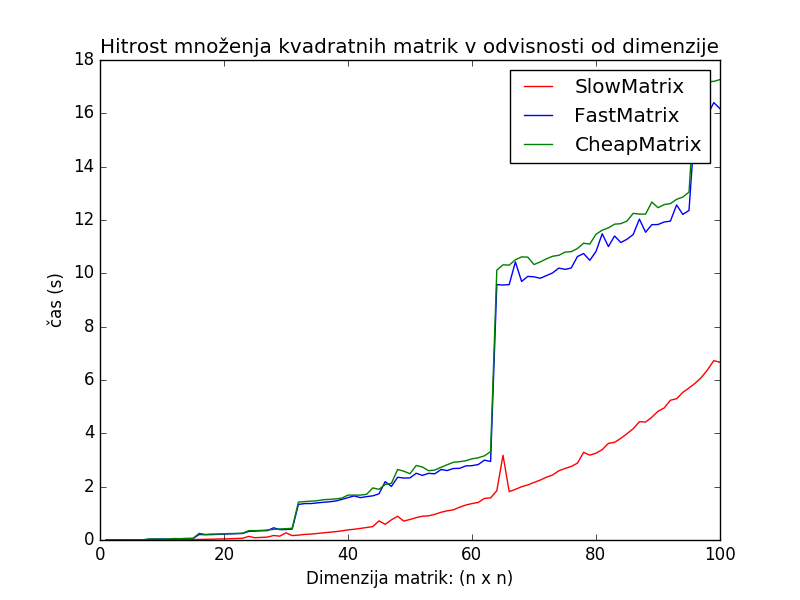

# Poročilo

*Eva Erzin*

## 1. Opisi algoritmov

Množimo matriki dimenzij n x k in k x m, da dobimo matriko dimenzije n x m.

### 1.1 SlowMatrix

Algritem za množenje v razredu SlowMatrix uporablja standardno množenje matrik. Člen na (i, j)-tem mestu ciljne matrike tako dobimo s skalarnim produktom i - te vrstice leve matrike ter j-tega stolpca desne matrike.

### 1.2 FastMatrix

Algoritem za množenje v razredu FastMatrix je razširjena verzija Strassenovega algoritma za množenje matrik, ki deluje za matrike poljubnih velikosti.
Matriki množimo rekurzivno in sicer tako, da vsako izmed stranic vhodnih matrik razpolovimo, nato pa z vsotami, razlikami in sedmimi rekurzivnimi klici množenja na s tem dobljenih podmatrikah dobimo podmatrike v ciljni matriki.
Če ima katera od matrik le eno vrstico ali stolpec, matriki zmnožimo z uporabo skalarnega produkta, torej z algoritmom opisanim v prejšnji točki.
Če dimenzije matrik niso sode, moramo posebej obravnavati še zadnji stolpec oziroma vrstico matrik(e) z liho dimenzijo. 
V primeru, ko je liha dimenzija, ki je vhodnima matrikama skupna (torej število stolpcev leve matrike in vrstic desne matrike), ugotovimo, da lahko produkt izračunamo tako, da z prej opisanim postopkom zmnožimo levo matriko brez zadnjega stolpca in desno matriko brez zadnje vrstice, nato pa temu produktu prištejemo še produkt manjkajočih stolpcev.
Če ima leva matrika liho število vrstic, najprej zmnožimo levo matriko brez zadnje vrstice in desno matriko ter tako dobimo člene ciljne matrike brez zadnje vrstice. Manjkajoče člene pa izračunamo s produktom zadnje vrstice leve matrike z desno vrstico.
Če pa ima desna matrika liho število stolpcev, najprej zmnožimo levo matriko z desno brez zadnjega stolpca ter tako dobimo člene ciljne matrike brez zadnjega stolpca. Tega dobimo z množenjem leve matrike z zadnjim stolpcem desne matrike.

### 1.3 CheapMatrix

Algoritem za množenje v razredu CheapMatrix je enak kot algoritem v razredu FastMatrix, le da porabi manj prostora. To dosežemo z uporabo delovne matrike in spreminjanjem vhodnih matrik, ki sta na koncu povrnjeni v začetno stanje. 


## 2. Analiza časovne in prostorske zahtevnosti

### 2.1 SlowMatrix

**Časovna zahtevnost**
Algoritem za vsak člen v matriki izvede k množenj in k-1 seštevanj. To je O(k) operacij. Izračunamo nxm členov, zato je skupna časovna zahtevnost O(nkm).

**Prostorska zahtevnost**
Algoritem ne porabi nič dodatnega prostora, saj elementom v ciljni matriki le prišteva produkte iz skalarnega produkta.

### 2.2 FastMatrix

V komentarjih v kodi so opisane časovne in prostorske zahtevnosti posameznih korakov. Časovno in prostorsko zahtevnost celotnega algoritma bomo izračunali s pomočjo krovnega izreka. 
Za lažje računanje zahtevnosti bomo definirali novo oznako N = max(n, m, k) in privzeli, da so vse dimenzije lihe, torej moramo opraviti največ dodatnega dela in porabiti največ prostora.

**Časovna zahtevnost**

```
T(N) = 7 * T(N/2) + 24 * O((N^2)/4) + 5 * O(N^2) + 2 * O(N) + O(1)
     = 7 * T(N/2) + 11 * O(N^2) + 2 * O(N)
     = 7 * T(N/2) + O(N^2)
     = O(N^(log2(7))) ~ O(N^(2,8))
           
... krovni izrek ...
  a = 7
  b = 2
  d = 2
  logb(a) > 2
  => T(N) = O(N^(log2(7)))
```

**Prostorska zahtevnost**

```
S(N) = 7 * S(N/2) + 33/4 * O(N^2) + 2 * O(N) + O(1)
     = 7 * S(N/2) + O(N^2)
     = O(N^(log2(7))) ~ O(N^(2,8))
```

### 2.3 CheapMatrix

**Časovna zahtevnost**

Časovna zahtevnost algoritma za množenje v razredu CheapMatrix se od zahtevnosti algoritma v razredu FastMatrix razlikuje le za konstanto, saj smo nekoliko več dela porabili za vračanje vhodnih matrik nazaj v prvotno stanje. Časovna zahtevnost je tako O(N^(log2(7))). Natančnejši opis se nahaja v komentarjih v kodi.

**Prostorska zahtevnost**

V vsakem koraku rekurzije porabimo le O(1) dodatnega prostora za reference in shranjevanje dimenzij matrik. 
Z M označimo min(n, k, m).
Izvedemo log2(M) korakov in v vsakem porabimo O(1) prostora. Skupaj je to torej O(log2(M)) prstora.

## 3. Primerjava časov izvajanja algoritmov 

Za primerjavo časov izvajanja algoritmov sem množila kvadratne matrike dimenzij od 1x1 do 100x100 s celoštevilskimi elementi med 0 in 10.
Primerjava algoritmov za množenje pravokotnih matrik ni toliko smiselna, saj lahko zelo hitro prisemo do množenja z uporabo skalarnega produkta.

Kot je razvidno iz spodnjega grafa in tabele, je metoda implementirana v razredu SlowMatrix za matrike takih dimenzij najhitrejša. Ostali dve sicer asimptotsko naraščata počasneje, vendar to postane uporabno šele pri matrikah veliko večjih dimenzij.

**Graf časov izvajanja algoritmov**



**Tabela časov izvajanja algoritmov**

|dimenzija|SlowMatrix|FastMatrix|CheapMatrix|
|---|---|---|---|
|1x1|0.000s|0.000s|0.000s|
|10x10|0.006s|0.033s|0.033s|
|20x20|0.044s|0.262s|0.372s|
|30x30|0.160s|0.414s|0.431s|
|40x40|0.370s|1.557s|1.643s|
|50x50|0.846s|2.318s|2.448s|
|60x60|1.329s|2.748s|2.894s|
|70x70|2.210s|10.855s|11.483s|
|80x80|3.263s|10.866s|11.505s|
|90x90|4.982s|11.966s|12.599s|
|100x100|6.712s|16.180s|17.198s|
|110x110|9.265s|17.590s|18.541s|
|120x120|12.158s|19.674s|20.328s|
|130x130|15.913s|66.564s|70.466s|
|140x140|20.295s|68.476s|73.256s|
|150x150|25.567s|71.071s|74.882s|
|160x160|31.563s|76.760s|80.565s|
|170x170|38.774s|79.343s|83.815s|
|180x180|46.990s|83.789s|86.867s|
|190x190|56.977s|86.899s|91.413s|
|200x200|67.090s|113.921s|121.100s|
