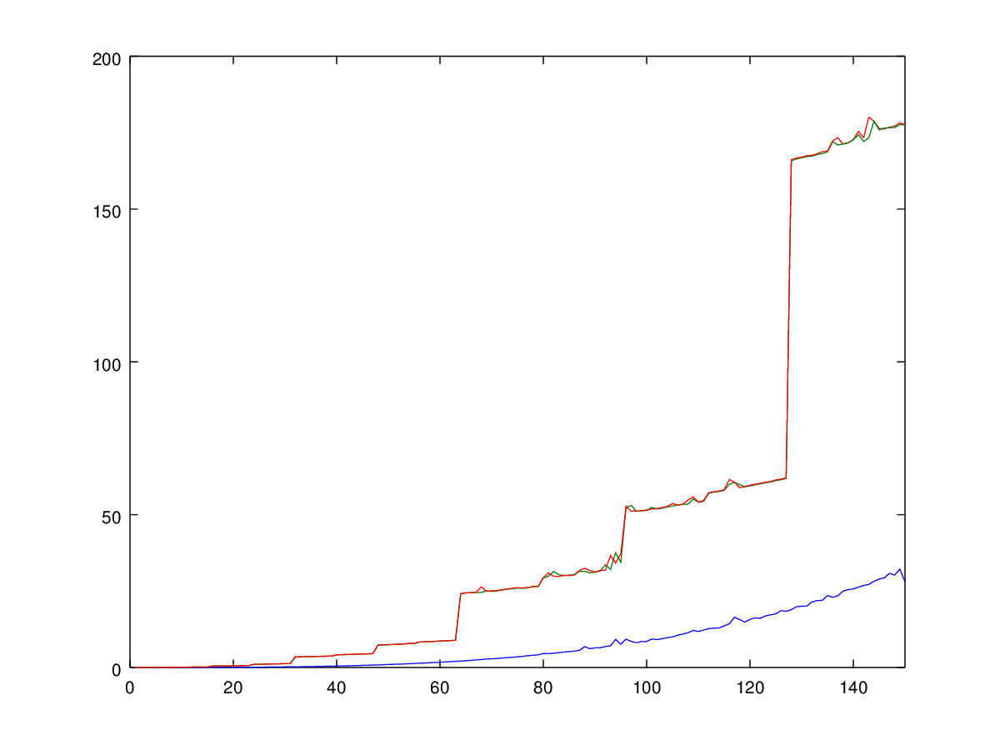
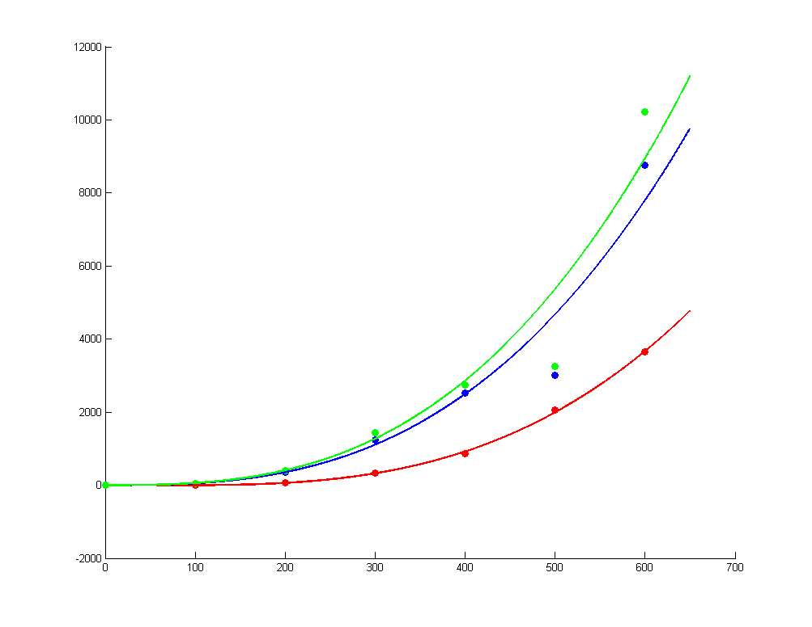

#Poročilo

*Juš Kosmač*

##Opis algoritmov, prostorska in časovna zahtevnost
Implementirane so tri metode za množenje matrik poljubnih velikosti. Prostorska in časovna zahtevnost bosta vedno izračunani
za množenje matrik velikosti *m x k* in *k x n*.
  

__SlowMatrix__  
Matrike množimo na običajen način, *( i , j )* - ti element ciljne matrike izračunamo kot skalarni produkt *i* - te vrstice in *j* - tega stolpca vhodnih matrik.

*Časovna zahtevnost*  
Do dimenzij vhodnih matrik dostopamo v času O(1). Za izračun posameznega elementa porabimo O(*k*) operacij (skalarni produkt dveh vektorjev dolžine *k*), velikost ciljne matrike je  *m x n*, torej skupno porabimo O(*mnk*) operacij. 

*Prostorska zahtevnost*  
Pri računanju skalarnih produktov vmesne produkte vedno prištevamo isti spremenljivki *temp*, ki jo nato zapišemo v ciljno matriko, torej ob večkratnem obhodu *for* zanke ne porabljamo nič novega prostora. 
Prostorska zahtevnost je torej O(1).


__FastMatrix__  
Matrike množimo z uporabo Strassenovega algoritma. Algoritem razpolovi stranici obeh matrik (če sta večji od 1) in s tem vsako matriko razdeli na 4 manjše podmatrike.
Podmatrike rekurzivno zmnožimo s sedmimi množenji in nato s seštevanjem/odštevanjem skonstruiramo ustrezne podmatrike v ciljni matriki.  

Če matriki nimata stranic sodih dolžin, moramo opraviti dodatna množenja zaradi zadnjega stolpca oz. zadnje vrstice. Ker v tem primeru vedno množimo vektor z matriko ali dva vektorja med sabo, lahko uporabljamo običajno množenje, brez da bi pokvarili skupno časovno zahtevnost. Vsa množenja opravljamo bločno (tudi zadnjo vrstico oz zadnji stolpec razdelimo na 2 ali 3 bloke (če je lihe dolžine)) in zaradi tega generiramo veliko manjših matrik, ki jih potem zmnožimo/seštejemo v rezultat. Vsakič, ko ustvarimo novo matriko, pa se pokliče zelo obsežen konstruktor razreda AbstractMatrix. Računanje preko bločnega množenja sem izbral zato, ker se mi je zdelo bolj naravno razumeti, kaj se dogaja (kot običajno množenje, le da gledamo bloke). Algoritem bi deloval hitreje, če bi npr. zadnji stolpec ciljne matrike izračunali kar kot produkt celotne leve vhodne matrike z zadnjim stolpcem desne vhodne matrike in ne bi množili bločno, saj bi tako ustvarili le eno novo matriko. Kljub temu pa časovna in prostorska zahtevnost ostajata enaki. 

Skica deljenja matrik (zadnji stolpec in zadnja vrstica nastopita samo, če so dimenzije lihe):
```
[ A B   x ]    [ E F   c ]
[ C D   y ]    [ G H   d ]
[ a b alfa]    [ u w beta]
```
* *A, B, C, D, E, F, G, H* so matrike
* *a, b, u, w* so transponirani vektorji (vrstice)
* *x, y, c, d* so vektorji (stolpci)
* *alfa* in *beta* sta skalarja

*Časovna zahtevnost*  
S `T(m,k,n)` označimo časovno zahtevnost množenja matrik. V najslabšem primeru so vsi *m, k* in *n* lihi, torej moramo opravljati dodatno delo.
V datoteki z algoritmom so bolj natančno opisane časovne zahtevnosti posameznih korakov. Če seštejemo zahtevnosti vseh korakov, dobimo rekurzivno formulo  
`T(m,k,n) = 7*T(m/2,k/2,n/2) + 9*O(m/2*k/2) + 9*O(k/2*n/2) + 20*O(m/2*n/2) + 8*O(m/2) + 8*O(n/2) + 2*O(k/2)`. 
Če upoštevamo, da zadnje 3 člene linearne zahtevnosti lahko zanemarimo, in uvedemo *N* = max(*m,k,n*), se nam formula poenostavi v
`T(N) = 7*T(N/2) + 38/4*O(N^2)`. Krovni izrek nam pove, da je skupna časovna zahtevnost `T(N) = O(N^log_2(7))`. Torej je tudi `T(m,k,n) = O(N^log_2(7))`. Če želimo bolj natančno časovno zahtevnost, pa jo izračunamo ročno iz poenostavljene enačbe `T(m,k,n) = 7*T(m/2,k/2,n/2) + O(mk) + O(kn) + O(mn)`. Ker je enačba simetrična glede na vse spremenljivke, lahko brez škode za splošnost predpostavimo *m* >= *k* >= *n*. Računamo:  
```
T(m,k,n) = 
7*T(m/2,k/2,n/2) + O(mk) + O(kn) + O(mn) = 
49*T(m/4,k/4,n/4) + 7*(O(m/2*k/2) + O(k/2*n/2) + O(m/2*n/2)) + O(mk) + O(kn) + O(mn) = ... =
(O(mk) + O(kn) + O(mn))*(1 + 7/4 + (7/4)^2 + ... + (7/4)^(log_2(n)-1)) + (7^log_2(n))*T(m/n,k/n,1) = 
(O(mk) + O(kn) + O(mn))*((7/4)^log_2(n) - 1)*4/3 + (n^log_2(7))*O(m/n*k/n) = 
(O(mk) + O(kn) + O(mn))*((7/4)^log_2(n)) + (n^log_2(7))*O(m/n*k/n) = 
(O(mk) + O(kn) + O(mn))*(n^log_2(7))/n^2 + (n^log_2(7))*O(m/n*k/n) = 
O((m/n*k/n + k/n + m/n)*(n^log_2(7))) = 
O(m/n*k/n*(n^log_2(7))) =  
O((mnk/n^3)*(n^log_2(7)))  
```
Če označimo z *M* = min(*m,k,n*), se rezultat prepiše v `T(m,k,n) = O((mnk/M^3)*(M^log_2(7)))`. Poglejmo si še robne primere: če je *m* = *k* = *n*, dobimo enako kot prej `T(m,k,n) = O(M^log_2(7)) = O(N^log_2(7))`, če pa je *M* = 1, dobimo enako kot pri SlowMatrix `T(m,k,n) = O(mnk)`.

*Prostorska zahtevnost*  
S `S(m,k,n)` označimo prostorsko zahtevnost množenja matrik. Spet obravnavamo le najslabši primer, ko so vse dimenzije lihe.
Če bi sešteli prostorske zahtevnosti vseh korakov, bi dobili  
`S(m,k,n) = 7*S(m/2,k/2,n/2) + 23*O(m/2*n/2) + 5*O(m/2*k/2) + 5*O(k/2*n/2) + 10*O(m/2) + 10*O(n/2)`. 
Vendar moramo paziti, saj so lokalne spremenljivke, ki jih ustvari funkcija, shranjene v spominu samo toliko časa, dokler je aktiven klic te funkcije. To pomeni, da prvi rekurzivni klic za množenje hrani vse spremenljivke, dokler ne pridemo do dna rekurzije (takrat je največja poraba spomina). Ko pa se vračamo nazaj gor, se nerabljene spremenljivke sproti brišejo iz spomina. Torej preden drugič rekurzivno množimo, se spomin do konca počisti. Kljub temu, da imamo 7 rekurzivnih množenj, zato porabimo le toliko prostora, kot ga porabi eno rekurzivno množenje. Torej je prava formula  
`S(m,k,n) = S(m/2,k/2,n/2) + 23*O(m/2*n/2) + 5*O(m/2*k/2) + 5*O(k/2*n/2) + 10*O(m/2) + 10*O(n/2)`.
Spet lahko enačbo poenostavimo v `S(N) = S(N/2) + 33/4*O(N^2)`, kar nam po krovnem izreku tokrat da S(*N*) = O(*N*^2). Bolj natančno pa spet lahko računamo (*m* >= *k* >= *n*):  
```
S(m,k,n) = 
S(m/2,k/2,n/2) + O(mk) + O(kn) + O(mn) = 
S(m/4,k/4,n/4) + O(m/2*k/2) + O(k/2*n/2) + O(m/2*n/2) + O(mk) + O(kn) + O(mn) = ... = 
T(m/n,k/n,1) + (O(mk) + O(kn) + O(mn))*(1 + 1/4 + (1/4)^2 + ... + (1/4)^(log_2(n)-1)) = 
O(1) (običajno množenje) + (O(mk) + O(kn) + O(mn))*(1 - (1/4)^log_2(n))*4/3 = 
O(mk) + O(kn) + O(mn) = 
O(mk) = 
O(mkn/n)
```
Torej dobimo `S(m,k,n) = O(mkn/M)`. Pri *m* = *k* = *n* spet dobimo `S(m,k,n) = O(N^2)`, pri *M* = 1 pa formula ne da pravega rezultata. Pri izpeljavi smo namreč implicitno privzeli, da lahko *n* vsaj enkrat razpolovimo.

__CheapMatrix__  
Algoritem za množenje je enak kot pri FastMatrix, le da varčuje s prostorom. Pomagamo si z dodatno delovno matriko, v katero shranjujemo vmesne rezultate množenja. Med množenjem spreminjamo vhodni matriki, vendar ju sproti popravljamo nazaj v prvotno stanje. Dokler je ciljna matrika še prazna, zapisujemo produkte *P_i* kar vanjo, nato pa v delovno matriko in jih prištevamo ustreznim podmatrikam ciljne matrike. Podrobnejši komentarji so v datoteki z algoritmom.

*Časovna zahtevnost*  
S `T(m,k,n)` spet označimo časovno zahtevnost množenja matrik.
Velja  
`T(m,k,n) = 7*T(m/2,k/2,n/2) + 13*O(m/2*k/2) + 13*O(k/2*n/2) + 16*O(m/2*n/2) + 4*O(m/2) + 4*O(n/2) + 2*O(k/2)`   
oziroma `T(N) = 7*T(N/2) + 42/4*O(N^2)`, kar nam spet da časovno zahtevnost `T(N) = O(N^(log_2(7)))`. Tudi natančnejši izračun je enak kot pri FastMatrix: `T(m,k,n) = O((mnk/M*^3)*(M^log_2(7)))`, razlikuje se le v konstanti. 
Pri CheapMatrix smo opravljali precej več seštevanj, saj smo morali vhodni matriki ves čas popravljati nazaj na prvotno stanje. Nekaj dela pa smo si prihranili, 
ko smo rezultate množenj zapisovali direktno v ciljno matriko in nam jih ni bilo potrebno naknadno prepisovati.

*Prostorska zahtevnost*  
Algoritem na začetku ustvari delovno matriko, ki je enakih dimenzij kot ciljna matrika. S tem porabimo O(mn) prostora. Poleg rekurzivnih klicev smo porabili le O(1) prostora. Rekurzivne klice vedno opravljamo z deli že obstoječe delovne matrike, torej se ne ustvarjajo nove delovne matrike.
Z enakim razmislekom kot prej vidimo, da je prostorska zahtevnost odvisna le od največje globine rekurzije. Iz enačbe `S(m,k,n) = S(m/2,k/2,n/2) + O(1) = S(m/4,k/4,n/4) + 2*O(1) = ...` sledi, da je globina enaka log_2(*M*) in na vsakem koraku rekurzije dobimo eno konstanto več. Torej je `S(m,k,n) = O(log_2(M))`, kar ustreza zahtevi po največ O(log(*mkn*)) dodatnega prostora poleg delovne matrike. 

##Primerjava časov izvajanja algoritmov
Primerjali bomo samo množenje kvadratnih matrik. Če bi množili matrike, ki imajo eno dimenzijo precej večjo ali manjšo od ostalih dveh, bi lahko naredili sorazmerno malo razpolavlanj, preden bi prišli do stranice z velikostjo 1. V tem primeru pa vsi trije algoritmi delujejo enako. Zato bi tudi pri FastMatrix in CheapMatrix večino dela opravili z običajnim množenjem in bi zmanjšali razliko med časovno zahtevnostjo SlowMatrixa in Fast/CheapMatrixa.  

Za *m* = *k* = *n* = 1, 2, ... , 150 smo generirali naključne matrike s celoštevilskimi elementi med -100 in 100. Za vsakega izmed treh razredov smo ustvarili dve matriki in izmerili koliko časa potrebujemo za množenje. Graf je prikazan na spodnji sliki (čas smo merili v sekundah): modra barva predstavlja SlowMatrix, rdeča in zelena pa FastMatrix in CheapMatrix.  



Vidimo lahko, da med Fast in CheapMatrix ni skoraj nobene razlike, SlowMatrix pa je precej hitrejši od obeh. Kljub temu, da ima običajno množenje asimptotično slabšo časovno zahtevnost, pa so konstante pri Strassenovem algoritmu tako velike, da je za manjše matrike tako množenje precej počasnejše. Opazimo tudi, da čas za množenje s SlowMatrixom narašča zelo enakomerno, pri Fast/CheapMatrixu pa imamo na nekaterih mestih občutne skoke. Največji skok se zgodi pri dimenziji 128 = 2^7, ko moramo matriko še sedmič razpoloviti in s tem povečamo globino rekurzije (ostali večji skoki so pri 64 = 2^6 in 96 = 64 + 32 = 2^6 + 2^5). Če pa ostajamo na istem nivoju rekurzije, čas tudi tukaj narašča dokaj enakomerno.  

Če si ogledamo matrike malo večjih dimenzij (*m* = *k* = *n* = 100, 200, ... , 600), opazimo, da čas (spet merjen v sekundah) za množenje narašča v skladu z izračunano časovno zahtevnostjo. Modre točke pripadajo FastMatrixu, zelene CheapMatrixu, rdeče pa SlowMatrixu.



|   |100   |200   |300   |400   |500   |600   |
|---|---|---|---|---|---|---|
|SlowMatrix   |7.3   |71.9   |322.6  |871.2  |2057.2   |3652.4   |
|FastMatrix   |54.7   |362.9  |1247.7  |2533.1  |3013.5   |8756.5   |
|CheapMatrix   |55.4   |391.9   |1440.8   |2752.8  |3262.9   |10220.3  |

Če primerjamo razmerja med dimenzijami in časi, ugotovimo, da se pri Fast/CheapMatrix zelo dobro ujemajo s predvidenimi (npr. če dvakrat povečamo velikost matrike, bomo za množenje porabili 2^log_2(7) = 2^2,81  - krat več časa). Pri SlowMatrix pa je dejansko razmerje malce večje od predvidenega (za dvakrat večjo matriko porabimo približno 2^3.4  - krat več časa namesto 2^3).

Vidimo, da sta Fast/CheapMatrix zelo podobna, SlowMatrix pa je hitrejši. Z modro, zeleno in rdečo krivuljo, smo poskusili točke najbolje aproksimirati po metodi najmanjših kvadratov. Rdeča krivulja se zelo dobro prilega točkam, pri modri in zeleni krivulji pa ena točka precej odstopa (leži pod krivuljo). To je ravno točka pri velikosti 500, ki je zelo blizu 512 = 2^9, kjer bi se zgodil občuten skok v času množenja (kot smo razložili prej). Za rdečo krivuljo smo izbrali najbolj prilegajoč se polinom tretje stopnje (2.2311\*(10^-5)\*x^3 - 3.2437\*(10^-3)\*x^2 + 2.3498\*(10^-2)\*x + 6.5569). Modrih in zelenih točk nismo mogli aproksimirati s polinomom, saj je časovna zahtevnost O(*N*^(log_2(7))). Lahko bi jih aproksimirali z racionalno funkcijo, pri kateri se razmerje stopenj polinomov v števcu in imenovalcu čimbolj približa log_2(7) = 2,81. Z razlogom poenostavitve pa smo jih aproksimirali kar s funkcijo oblike *a*\*x^2,81 (*a* = 1.2169\*10^-4 za modro in *a* = 1.3970\*10^-4 za zeleno). S tem lahko ocenimo približno velikost matrik, pri kateri bi FastMatrix množil hitreje kot SlowMatrix. Izkaže se, da se to zgodi pri velikosti približno 8300.

