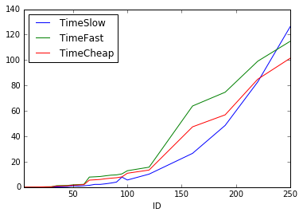

# Poročilo

*Luka Avbreht*

V nalogi smo implementirali tri načine za množenje matrik.
Množenje matrik je velikosti `A = m x n` in `B = k x l` je mogoce le v primeru, ko je število stoplcev prve matrike (n) enako stevilu vrstic druge matrike (k). 
Nujin produkt `AB` bo bila matrika velikosti `m x l`, torej imela enako stevilo vrstic, kot prva matrika, ter stevilo stoplcev druge matrike. 

## SlowMatrix

Gre za običajno množenje matrik, kot ga ponavadi izvajamo na roke. Za vsak element v ciljni matriki, se moramo z for zanko sprehoditi cez sirino leve matrike, oz visino desne.

### Časovna zahtevbnost 

Če zmnožimo matriki `(n x m)` in `(m x k)`, je časovna zahtevnost `O(n*m*k)` oziroma približno 
`O(n^3)`. kjer je `n = max{n,m,k}`

### Prostorska zahtevnost

Če zmnožimo matriki `(n x m)` in `(m x k)` je prostorska zahtevnost 
`O(n*m)+O(m*n)+O(n*k)` Kar lahko ocenimo z `O(max{m,n,k})`. Z drugimi besedami 
ne potrebujemo nobenega dodatnega prostora kot velikosi ciljne matrike. (V kolikor si moramo ciljno matriko pripraviti 
preden izračunamo produkt)

## FastMatrix

Pomagali si bomo z tako imenovanim Strassenovim algoritmom.  
To je algoritem pri katerem za mnozenje matrik uporabimo metodo deli in vladaj na sledec nacin:  
```
  X =   in   Y =   
[ A B ]    [ E F ]    
[ C D ]    [ G H ]      
```  
s pomočjo sedmih produktov  

* *P1 = A (F - H)*,
* *P2 = (A + B) H*,
* *P3 = (C + D) E*,
* *P4 = D (G - E)*,
* *P5 = (A + D) (E + H)*,
* *P6 = (B - D) (G + H)* 
* *P7 = (A - C) (E + F)*.

Produkt potem izračunamo kot  
```
                  X*Y =
[ P4 + P5 + P6 - P2         P1 + P2      ]
[      P3 + P4         P1 + P5 - P3 - P7 ]
```


### Časovna zahtevnost

S pomočjo [krovnega izreka] (https://en.wikipedia.org/wiki/Master_theorem) bomo dokazali časovno zahtevnost strassenovega algoritma.

Predpostavimo, da je sirina in visina obeh matrik sodo stevilo. V kolikor matrika ni oblike `2n x 2m` jo lahko z pomocjo dodajanja vrstic oz stolcev z samimi niclami do takega primera razširimo.   
Naj bo n = max{n,m,k}  
Problem razdelimo na sedem delov, ki so vsak pol manjsi od svojega oredhodnika. Iz izracunanih rezultatov resitev nazaj sestavimo v `O(n^2)`. Iz teh podatkov dobimo vrednosti, ki jih uporabimo v krovnem izreku   
* b = 2  
* a = 7  
* d = 2  


Vidimo, da pademo v opcijo, ko je `d < log_b(a)` torej je csovna zahtevnost algoritma enaka:

`T(n) = O(n^(log_2(7)))`


[Več] (http://wiki.fmf.uni-lj.si/wiki/Strassenovo_mno%C5%BEenje_matrik)

### Prostorska zahtevnost

Podobno kot pri računanju časovne zahtevnosti bomo predpostavili, da je matrika oblike `2n x 2m`.  
V vsakem koraku si dodatno shranimo 7 matrik, vsaka pa je polmanjša od prejšne. Tako ponovno uporabimo krovni izrek, in izračunamo, dodatno prostorsko zahtevnost algoritma.  

`P(n) =  O(n^log_2(7))`

## CheapMatrix

V podrazredu CheapMatrix smo množenje implementirali na zelo podoben način kot v razredu FastMatrix, Z to razliko, da smo ciljni matriki (Rezultatu) Podali se delovno matriko, v katero smo shranjevali umesne vrednosti, ter jo uporabljali v rekurziji. Z tem smo algoritmu iz Fastmarixa zmanjšali prostorsko zahtevnost. 

### Časovna zahtevnost

Prav tako kot v razredu FastMatrix je časovna zahtevnost algoritma enaka.

`T(n) = O(n^(log_2(7)))`

Gre namreč za enak algortitem, le da je v tem primeru le ta prostorsko manj zahteven.

### Prostorska zahtevnost

V razredu CheapMatrix, smo Strassenov algoritem implementirali na način, da v kolikor mu podamo delovno matriko (Še eno 
matriko velikosti cilje), algoritem ne porabi nobenega dodatnega prostora.

## Primerjava dejanskih časov izvajanja algortitmov

Velikost matrik A in B |  SlowMatrix  |  FastMatrix |   CheapMatrix 
----------------------------------|--------------|-------------|----------------- 
    5x5 * 5x5 | 0.0s | 0.004s | 0.003s 
    10x10 * 10x10 | 0.004s | 0.0266s | 0.02s 
    15x15 * 15x15 | 0.015s | 0.046s | 0.0401s 
    20x20 * 20x20 | 0.036s | 0.1903s | 0.1391s 
    25x25 * 25x25 | 0.0711s | 0.2632s | 0.2317s 
    30x30 * 30x30 | 0.1246s | 0.3067s | 0.2677s 
    35x35 * 35x35 | 0.1961s | 1.1524s | 0.8106s 
    40x40 * 40x40 | 0.2972s | 1.2569s | 0.9428s 
    45x45 * 45x45 | 0.4248s | 1.3635s | 1.0472s 
    50x50 * 50x50 | 1.0107s | 1.8119s | 1.5521s 
    55x55 * 55x55 | 0.8201s | 2.0545s | 1.7397s 
    60x60 * 60x60 | 1.0603s | 2.2217s | 1.9528s 
    65x65 * 65x65 | 1.4323s | 7.9226s | 5.5254s
    70x70 * 70x70 | 2.1756s | 8.1363s | 5.7758s
    75x75 * 75x75 | 2.1761s | 8.3805s | 6.0605s
    80x80 * 80x80 | 2.6409s | 8.9291s | 6.6314s
    85x85 * 85x85 | 3.2369s | 9.4379s | 7.0513s
    90x90 * 90x90 | 3.9846s | 9.6620s | 7.4127s
    95x95 * 95x95 | 7.9232s | 10.4323s | 8.0797s
    100x100 * 100x100 | 5.6216s | 12.9171s | 10.9485s
    120x120 * 120x120 | 10.2468s | 15.7165s | 13.4536s
    140x140 * 140x140 | 17.0139s | 57.5209s | 40.6929s
    160x160 * 160x160 | 26.5985s | 63.8716s | 47.4685s
    190x190 * 190x190 | 48.5989s | 74.7090s | 56.9132s
    220x220 * 220x220 | 82.8555s | 99.1345s | 84.9595s
    250x250 * 250x250 | 126.53s | 114.8632s | 101.556s
    300x300 * 300x300 | 238.8838s | 423.1175s | 308.1845s
    350x350 * 350x350 | 425.2465s | 484.1813s | 367.4054s
    400x400 * 400x400 | 672.2815s | 635.0626s | 538.8132s


Na vseh grafix X-os predstavlja velikost matrik (naprimer pri x je 15 gre za matriko velikosti 15x15), 
Y-os pa predstavlja šas, ki ga posamezen razred potrebuje za izračun merjen v sekundah. 

  
Zgornji graf prikazuje casovno odvisnost delovanja algoritmov, kjer za vrednosti izberemo naklučna števila, za dimenzije pa števila, ki se seštejejo v n

  
Prikazuje graf naraščanja matrik časa, ki ga porabimo da zmnožimo različe kvadratne matrike, z vrednostmi enakimi 1.


