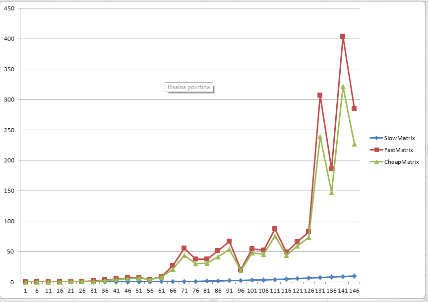

# Poročilo

Samo Kralj

# SlowMatrix

SlowMatrix ima implementirano navadno množenje matrik. Torej za ( i, j ) člen v matriki bo izračunal 
skalarni produkt i-te vrstice in j-tega stolpca.

## Časovna Zahtevnost:

Če množimo matriki velikosti n x m in m x k, bo ciljna matrika velikosti n x k. Za vsak element v ciljni
matriki pa opravimo m operacij. Skupna časovna zahtevnost bo torej O(n * k * m).

## Prostorska Zahtevnost:

Prostor, ki ga porabi je velikost ciljne matrike.

# FastMatrix

FastMatrix ima implementirano Strassenovo množenje matrik. Delovanje lahko vidimo na primeru:

Naj bo A matrika velikosti ( 2 * n + 1) x ( 2 * m + 1 ) in naj bo B velikosti ( 2 * m + 1) x ( 2 * k + 1). 
Algoritem bo najprej vzel največjo podmatriko sodih dimenzij obeh matrik in ju zmnožil. V našem primeru 
bi matriko A razdelil na 4 podmatrike velikosti n x m in matriko B na 4 podmatrike velikosti m x k in le-te
s Strassenovim algoritmom zmnožil. 

Lihe vrstice in stolpce obravnava sledeče:
- Če ima leva matrika liho število vrstic bo to zadnjo liho vrstico skalarno množil z vsakim stolpcem desne
matrike in rezultat zapisal v ciljno matriko. 
- Če ima desna matrika liho število stolpcev bo algoritem vsako vrstico leve matrike množil skalarno z zadnjim
stolpcem in rezultat zapisal v ciljno matriko.
- V primeru lihega števila stolpcev leve matrike in seveda tudi liheha števila vrstic desne matrike pa bo
ciljni matriki na ustreznih mestih prištel še matriko, ki jo če skupaj zmnožimo zadnji stolpec leve matrike
in zadnjo vrstico desne matrike. Več o tem in izpeljava pa je napisano med komentarji v kodi.

Matrike velikosti 1 x X ali X x 1 zmnožimo na navaden način. 

## Časovna zahtevnost:

Omejimo se na množenje kvadratnih matrik. 

Za množenje matrike dimenzije n x n porabimo:
- O( 1 ) ... definiranje spremenljivk in pointerjev
- 22 * (n/2)^2 ... seštevanja in odštevanja matrik dimenzij n/2 x n/2
- O( n^2 ) ... generiranje matrik v katere zapisujemo vmesne rezultate. 
- 7 množenj matrik velikosti n/2 x n/2

Sledi: T(n) = 7 * T ( n/2 ) + 22 * (n/2)^2 + O(n^2) + O(1)
Po krovnem izreku sledi, da je časovna zahtevnost algoritma O(n^(log(2, 7))), kar je približno O(n^2.80).

## Prostorska Zahtevnost:

Za matriko dimenzij n x n bo algoritem porabil:

- 7 * prostor, ki ga porabi za množenje matrike dimenzije n/2 x n/2
- 29 * (n/2)^2 ... prostor, ki ga porabi za zapis matrike
- O( 1 ) ... prostor, ki ga porabi za zapis konstant in pointerjev

Skupaj sledi: P(n) = 7 * P(n/2) + 29 * (n/2)^2 + O(1)
Po krovnem izreku sledi, da algoritem porabi O( n^2.80 ) prostora.

# CheapMatrix

CheapMatrix ima implementirano Strassenovo množenje matrik s to lastnostjo, da pri svojem množenju ne porabi
veliko dodatnega prostora. Za množenje dveh matrik bo potreboval le 2 matriki ciljnih dimenzij in nekaj dodatnega
konstantega prostora za zapis konstant za bolj berljivo in čitljivo kodo. 

Matrike dimenzij 1 x X in X x 1 ter zadnje lihe vrstice in stolpce množi na enak način kot FastMatrix. Pri tem
pazi, da matriko, ki jo dobimo če zmnožimo zadnji lih stolpec in zadnjo liho vrstico, zmnoži v delovno matriko in 
ne porabi več dodatnega prostora. 

Algoritem deluje na principu tega, da pri Strassenovemu množenju sicer potrebujemo 7 podmatrik, a ne potrebujemo
vseh hkrati. Tako lahko s pametnim zaporedjem seštevanj in množenj matriki zmnožili na Strassenov način brez, da bi 
prekoračili prostor, ki ga imamo na razpolago. Primer, recimo matriko P6 ali P7 potrebujemo le pri zgornji levi oz.
spodnji levi podmatriki. 

## Časovna Zahtevnost:

Časovna zahtevnost je podobna časovni zahtevnosti FastMatrix le da tokrat porabimo še dodatnih O(n^2) operacij
za čiščenje matrik, ki smo jih med množenjem uporabljali kot delovne matrike. 

Skupne časovne zahtevnosti to ne spremeni in časovna zahtevnost ostaja O(n^2.80). 

## Prostorska Zahtevnost:

Algoritem kot je zahtevano porabi le: 2*velikost cilje matrike + O ( 1 ) prostora. 

## Primerjava časovnih zahtevnosti

Iz grafov lahko vidimo, da je SlowMatrix za nizke dimenzije matrik najhitrejši, CheapMatrix pa je malo hitrejši
kot FastMatrix. Opazimo lahko večje skoke takrat, ko preskočimo naslednjo potenco 2. Do skokov vmes pa pride odvisno od tega
koliko lihih delov moramo ročno zmnožiti. Če za matriko dimenzije n potrebuje t časa, potem za matriko 
dimenzije 2*n potebujemo 2^2.80 * t = 6.96 * t časa. 
Rezultate lahko vidimo iz tabele, recimo: 
- T(121) = 7.152 * T(61)
- T(81) = 7.07 * T(41)
- T(141) = 7.3 * T(71)

 

| Dimenzija  n x n matrike | SlowMatrix | FastMatrix | CheapMatrix |
|--------------------------|------------|------------|-------------|
| 1                        | 0.00000    | 0.00000    | 0.00000     |
| 6                        | 0.00101    | 0.00900    | 0.00802     |
| 11                       | 0.00599    | 0.09861    | 0.08205     |
| 16                       | 0.01404    | 0.25218    | 0.19918     |
| 21                       | 0.02960    | 0.73337    | 0.60864     |
| 26                       | 0.05504    | 0.69824    | 0.63414     |
| 31                       | 0.08995    | 1.31659    | 1.15160     |
| 36                       | 0.13423    | 3.47407    | 2.80719     |
| 41                       | 0.19271    | 5.33825    | 4.36808     |
| 46                       | 0.26777    | 6.90935    | 5.71948     |
| 51                       | 0.36697    | 7.61578    | 6.68805     |
| 56                       | 0.47661    | 4.44796    | 4.10830     |
| 61                       | 0.61859    | 9.23411    | 8.27704     |
| 66                       | 0.88228    | 26.78006   | 21.19306    |
| 71                       | 1.06562    | 55.31005   | 43.76345    |
| 76                       | 1.29112    | 37.88660   | 30.47640    |
| 81                       | 1.57240    | 37.70953   | 30.94778    |
| 86                       | 1.90460    | 51.04236   | 41.94044    |
| 91                       | 2.25783    | 66.66984   | 54.13996    |
| 96                       | 2.68171    | 20.20618   | 18.47330    |
| 101                      | 3.13112    | 54.61943   | 47.91773    |
| 106                      | 3.62462    | 52.18234   | 46.03415    |
| 111                      | 4.16583    | 87.12482   | 76.08096    |
| 116                      | 4.75356    | 48.70822   | 44.01852    |
| 121                      | 5.58677    | 65.89399   | 59.30071    |
| 126                      | 6.28836    | 82.44334   | 73.54822    |
| 131                      | 7.18465    | 306.70878  | 239.02274   |
| 136                      | 8.16946    | 185.71916  | 147.62142   |
| 141                      | 9.21401    | 403.91843  | 321.46634   |
| 146                      | 10.22815   | 285.06649  | 227.44043   |