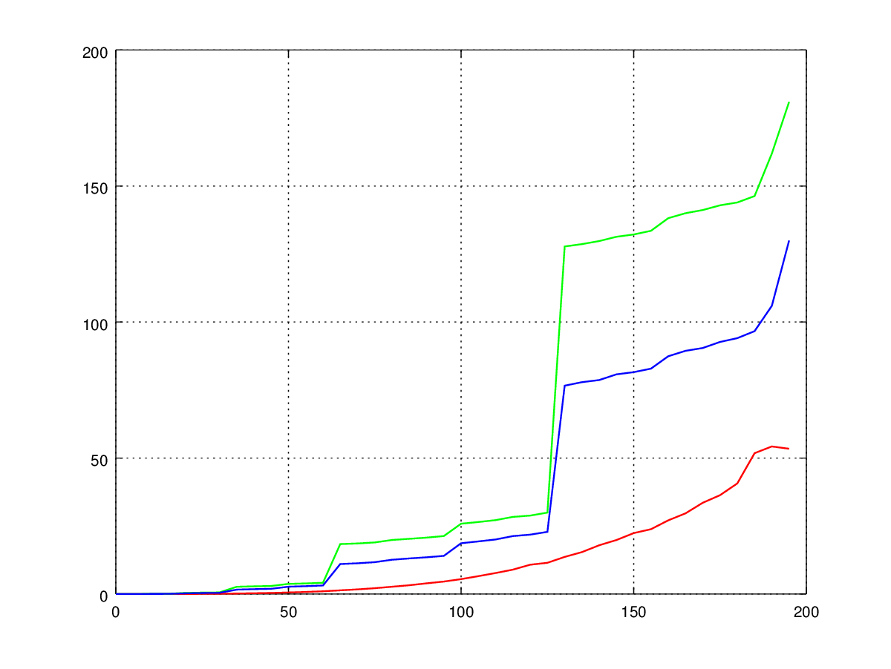

# Poročilo
*Žiga Zupančič*

## Opis algoritmov
### Razred `SlowMatrix`

Razred `SlowMatrix` v metodi `multiply` implementira naivno množenje matrik - vrstice leve matrike skalarno množimo 
z vrsticami desne matrike. Skalarni produkt računamo s pomočjo spremenljivke `temp`, katere vrednost po izračunu 
zapišemo na (i, j)-to mesto ciljne matrike, kjer je `i` vrstice leve matrike in `j` stolpec desne.

### Razred `FastMatrix`

Metoda `multiply` v razredu `FastMatrix` najprej preveri, če so matrike ustreznih dimeznij za množenje, nato pa si
jih shrani v spremenljivke. V spremenljivke `ms`,`ns` in `ps` si shrani sodo število, ki je enako ustrezni dimenziji 
matrike, če je matrika soda in za eno manjše od dimenzije matrike, če je matrika liha. Če je katera od dimenzij leve ali
 desne matrike enaka 1, matrike ne moremo razdeliti na 4 podmatrike (torej ne moremo uporabiti Strassenovega algoritma) 
in zato matrike zmnožimo z metodo `multiply` v razredu `SlowMatrix`. Sicer pa razdelimo podmatriko `left[0:ns][0:ms]`, 
ki ima same sode dimenzije, na štiri enako velike podmatrike (`A`, `B`, `C`, `D`), ki jih bomo uporabili pri množenju. 
Podobno tudi `right[0:ms, 0:ps]` na `E`, `F`, `G` in `H`. Sledi rekurzivni izračun produktov `P1` do `P7`.
Ta se nekoč konča, saj se dimenzije matrik, ki jih množimo na vsakem koraku razpolovijo, če pa je katera izmed dimenzij
enaka 1, pa jih zmnožimo z metodo `multiply` v `SlowMatrix`. Nato obravnavamo še primere, če je katera izmed dimenzij 
matrik `left` ali `right` liha (posebej izračunamo produkte z zadnjim stolpcem leve matrike, zadnjo vrstico leve 
matrike in zadnjim stolpecm desne matrike). V tem primeru računamo produkte, kjer ima vsaj ena izmed matrik le eno 
vrstico ali stolpec. Nazadnje še izračunamo potrebne vsote matrik `P1` do `P7` in jih zapišemo v ciljno matriko, ter
prišejemo posebne produkte z zadnjim stolpcem leve matrike (lahko so 0).

### Razred `CheapMatrix`

Metoda `multiply` v tem razredu deluje podobno kot v razredu `FastMatrix`, le da pri delu porabi le `O(log(kmn))` 
dodatnega prostora. Izračun `P4 + P5 + P6 - P2` poteka tako, da produkt `P6` takoj zapišemo v končno matriko na mesto 
zgoraj levo, izračunamo ga pa tako, da vhodni podmatriki `B` odštejemo `D` (da se ne ustvari nova matrika) ter 
podmatriki `G` prištejemo `H` in nato zmnožimo `B * G` z neobveznim parametrom delavne matrike, ki je enake 
dimenzije kot produkt (podmatrike naše delavne matrike). Nato `B` in `G` povrnemo v prvotno stanje.
Ostale produkte izračunamo podobno in zapišemo v delavno matriko, pri čemer neuporabljeni del delavne matrike uporabimo 
kot delavno matriko pri rekurzivnem računanju produkta. V delavni matriki so naenkrat le trije produkti izmed `P1` do 
`P7`, saj obstoječe po uporabi prepišemo z drugimi, ki jih bomo potrebovali. Tako izračunamo vse štiri vsote produktov 
Strassenovega algoritma, posebna obravnava zadnjih stolpcev in vrstic lihih matrik pa je enaka kot prej, le da podamo 
še delavno matriko, ki pa se ne uporabi, saj se ponovno kliče metoda `multiply` iz `SlowMatrix`.
  
## Analiza časovne in prostorske zahtevnosti

Naj bo `X` leva matrika in `Y` desna, njun produkt `Z` in delavna `W`. `n x m` je velikost matrike `X`, `m x p` je 
velikost matrike `Y`, `n x p` pa velikost matrike `Z` in `D`. Ogledali si bomo najslabši primer - ko so vse dimenzije 
lihe.

T(n,m,p) ... časovna zahtevnost množenja matrik `n x m` in `m x p`.

S(n,m,p) ... prostorska zahtevnost množenja matrik `n x m` in `m x p`.

### Časovna zahtevnost
__SlowMatrix__: `O(mnp)` operacij - za izračun skalarnega produkta vrstice in stolpca je potrebnih `k` množenj in 
`k - 1` seštevanj. Izračunati moramo `p * n` skalarnih produktov.

__FastMatrix__: 
Najprej si shranimo dimenzije matrik in nekatera druga števila, kar porabi `O(1)` operacij.

Če je katera od dimenzij enaka 1, uporabimo SlowMatrix:
*  m == 1: `O(np)` operacij, saj uporabimo mnozenje iz SlowMatrix
*  n == 1: `O(mp)` operacij, saj uporabimo mnozenje iz SlowMatrix
*  p == 1: `O(mn)` operacij, saj uporabimo mnozenje iz SlowMatrix

Sicer pa si najprej ustvarimo kazalce na dele matrike (`A`, `B`, ... , `H`), kar porabi `O(1)` operacij, saj ne izdelamo 
novih matrik.

Izračun `P1` do `P7`: seštevanja porabijo `5*O(n/2 * m/2) + 5*O(m/2 * p/2)`, rekurzivna množenja pa 
`7*T(n/2, m/2, p/2)`.

Sledi inicializacija štirih spremenljivk - `O(1)` ter izračun štirih produkti z le enim stolpcem, kar porabi 
`4 * O(n/2 * p/2)`. Nato izračunamo produkte leve matrike z zadnjim stolpcem desne matrike - `O(m*n)` ter zadnjo vrstico 
leve matrike z desno matriko brez zadnjega stolpca - `O(m*(p-1))`. Na koncu še izračunamo 16 vsot (`16*O(n/2 * p/2)`) 
ter zapišemo v končno matriko (`4*O(n/2 * p/2)`).

*SKUPAJ*: `T(n,m,p) = 7*T(n/2, m/2, p/2) + O(n/2 * m/2) + O(m/2 * p/2) + O(n/2 * p/2) + O(m*(p-1)) + O(m*n) + O(1) = 
O(n*m + m*p) + O(n/2 * p/2) + 7*T(n/2, m/2, p/2)`. S pomočjo krovnega izreka in `N = max(n,m,p)` dobimo: 
`T(N) = O(N^log2(7))`.

__CheapMatrix__:
Začetna inicializacija spremenljivk - `O(1)`, nato obravnavamo podobno kot pri `FastMatrix`. Ustvarimo si kazalce 
na dele matrike (`O(1)`), nato pa začnemo z računanjem produktov. 

Ko s seštevajni in odštevanji spreminjamo vhodne matrike, porabimo `10*O(n/2 * m/2) + 10*O(m/2 * p/2)` operacij. Kot pri 
`FastMatrix` imamo 7 produktov, ki porabijo `7*T(n/2 * m/2 * p/2)` operacij. Vmes pa še seštevamo `P1` do `P7` in jih 
 zapisujemo v končno matriko, kar porabi `8*O(n/2 * p/2)` operacij.

Podobno kot v `FastMatrix` imamo na koncu še produkte z matrikami, ki imajo eno dimenzijo enako 1, kar porabi 
`4*O(n/2 * p/2) + O(n*m) + O(m*p)` operacij.

*SKUPAJ*: `T(n,m,p) = 7*T(n/2, m/2, p/2) + O(n/2 * m/2) + O(m/2 * p/2) + O(n/2 * p/2) + O(m*p) + O(m*n) = 
O(n*m + m*p) + O(n/2 * p/2) + 7*T(n/2, m/2, p/2)`. Podobno kot v primeru `FastMatrix` tudi tukaj dobimo, da je 
`T(N) = O(N^log2(7))` za `N = max(n,m,p)`.

### Prostorska zahtevnost
__SlowMatrix__: porabi `O(1)` dodatnega prostora, saj se pri računanju skalarnega produkta vrednosti prištevajo 
spremenljivki `temp`, ki se nato zapiše v matriko na ustrezno mesto.

__FastMatrix__: Najprej si shranimo velikosti matrik in kazalce na dele matrik, kar porabi `O(1)` prostora. V primeru 
da je katera od dimenzij enaka 1, je prostorska zahtevnost enaka kot pri `SlowMatrix`, sicer pa potrebujemo 
`5*O(n/2 * m/2) + 5*O(m/2 * p/2)` prostora za izračun vsot pri računanju `P1` do `P7`, `7*S(n/2, m/2, p/2)` za rekurzivni 
izračun produktov ter `7*O(n/2 * p/2)` da te produkte shranimo. Sledi inicializacija štirih spremenljivk - `O(1)` ter 
izračun štirih produkti z le enim stolpcem, kar porabi `4 * O(n/2 * p/2)`. Ostale produkte pa zapišemo direktno v 
končno matriko in ker se uporabi množenje iz `SlowMatrix` porabimo le `O(1)` dodatnega prostora. Na koncu moramo 
izračunati še 16 vsot: `16*O(n/2 * p/2)`. Če seštejemo, dobimo: 
`S(n, m, p) = 18*O(1) + 5*O(n/2 * m/2) + 5*O(m/2 * p/2) + S(n/2, m/2, p/2) + 27*O(n/2 * p/2)`. Za `m = n = p` dobimo: 
`S(n) = S(n/2) + 37*O(n/2 * n/2) = O(n^2)` (po krovnem izreku).

__CheapMatrix__: Na začetku porabi `O(1)` dodatnega prostora za shranitev dimenzij in kazalcev na dele matrike. Če je 
katera od dimenzij leve ali desne matrike enaka 1, potem porabi `O(1)` dodatnega prostora, saj uporabi množenje iz 
`SlowMatrix`. Delavna matrika je velikosti `O(n * p)` - enako kot ciljna matrika. Pri rekurzivnem množenju vedno podamo 
del delavne matrike, tako, da se ne ustvarjajo nove. Poleg delavne matrike se torej ob vsakem rekurzivnem klicu porabi 
le `O(1)` dodatnega prostora. Velja torej `S(n, m, p) = S(n/2, m/2, p/2) + O(1) = S(n/4, m/4, p/4) + 2*O(1) = ...= 
O(log2(min(n, m, p)))` (s pomočjo krovnega izreka).

## Primerjava dejanskih časov izvajanja
Čase izvajanja bomo gledali le za kvadratne n x n matrike. V naslednji tabeli so prikazani časi v sekundah za vse tri
implementacije množenja v odvisnosti od velikosti matrik.

| n |SlowMatrix |FastMatrix |CheapMatrix|
|---|---|---|---|
| 5   |0.0005  |0.0084 |0.0050 |
| 10  |0.004   |0.066  |0.042  |
| 100 |5.5     |26.1   |18.9   |
| 200 |57.3    |181.2  |132.8  |
| 250 |127.9   |207.5  |163.0  |
| 300 |262.6   |920.8  |577.6  |
| 400 |828.0   |1256.8 |930.9  |
| 500 |1900.5  |1454.0 |1160.8 |
| 600 |3956.3  |6431.1 |4087.9 |

Opazimo, da pri majhnih `n` množenje v `SlowMatrix` deluje občutno hitreje kot `FastMatrix` ali `CheapMatrix`. Pri 
velikih `n` pa prevlada `n^3`, ki se hitreje povečuje in zato `SlowMatrix` takrat dosega slabše rezultate.
Spodnji graf prikazuje čas računanja produkta v odvisnosti od velikosti vhodnih matrik (n x n). Rdeča krivulja 
prikazuje množenje s SlowMatrix, zelena s FastMatrix in modra s CheapMatrix.

Opazimo "skoke", ki občutno povečajo čas množenje `FastMatrix` in `CheapMatrix`, saj se takrat zgodi dodaten rekurziven 
klic (pri 4, 8, 16, 32, 64, 128, ...) - ko matriko lahko večkrat razdelimo. Zato sta pri `n=500 < 512` `FastMatrix` in 
`CheapMatrix` hitrejša od `SlowMatrix`, pri `ǹ=600` pa ne več.