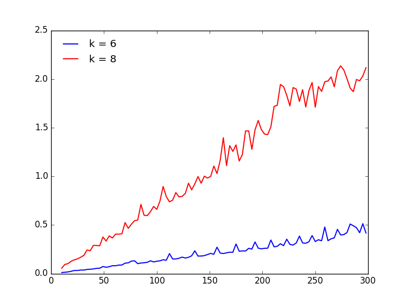
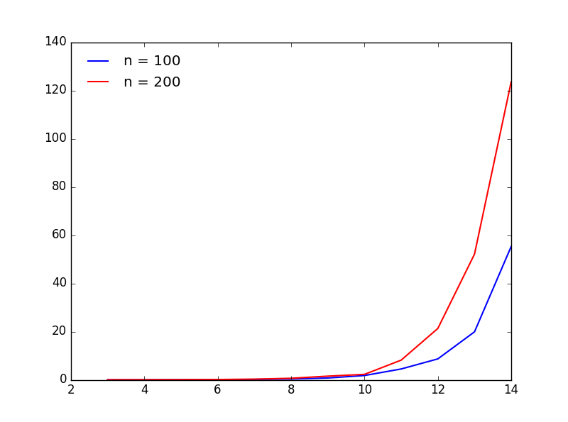

# Poročilo

*Gašper Domen Romih*

# Opis algoritma

Produkt cikla ter drevesa, si lahko predstavljamo kot drevo, ki ima na vsakem vozlišču še cikel. To bomo izkoristili tako,
da bomo gledali vozlišča dreves, ter jih kombinirali z vsemi ustreznimi podmnožicami cikla. Podmnožica cikla je ustrezna, če 
poljubna 2 elementa nista sosedna, saj v nasprotnem primeru bosta sosedna tudi v kartezičnem produktu, ter tako dobljena podmnožica
ni neodvisna. Podmnožice cikla si bomo predstavljali kot dvojiški zapis števil do velikosti `2^k`. Po potrebi bomo dopolnili z ničlami.
Tako dobimo podmnožico cikla `C_k`, ki vsebuje tiste elemente, kjer se pojavi enica v dvojiškem zapisu. V pomoč si definirajmo še slovar ustrezne, ki za ključ dobi 
število od `0` do `2^k` (podmnožico cikla) ter vrne seznam vseh podmnožic, ki se z njo ujemajo, tj. na istem mestu v dvojiškem zapisu nimata enice.
To potrebujemo, saj če želimo poiskati najtežjo množico, s tem da smo v korenu uporabili neko podmnožico cikla, moramo poiskati najtežjo množico, 
na njegovih potomcih pri pogoji da se podmnožica cikla "ujema" z podmnožico cikla c korenu.

# Analiza časovne in prostorse zahtevnosti

## Podmnožice cikla
Za pretvorbo števila med `0` in `2^k` v dvojiški zapis porabimo `O(k)` operacij ter prav toliko prostora. Nato preverimo, če se dve enici ne 
pojavita zapovrstjo za kar zopet potrebujemo `O(k)` operacij. Sepravi je časovna zahtevnost tega dela `O(k * 2*k)`
Vseh podmnožic je `2^k`, vendar je ustreznih nekaj manj. Prostorsko zahtevnost lahko navzgor omejimo z `O(k * 2*k)`. Označimo število ustreznih podmnožic
z `A_k`. Tako lahko prostorsko zahtevnost zapišemo kot `O(k * A_k) < O(k * 2^k)`

Naslednje poračunamo slovar tež in sicer za vsako ustrezno podmnožico cikla ter vozlišče drevesa izračunamo težo skupne podnožice.
Za to porabimo `O(A_k * n* k) ` operacij, prostorsko pa porabimo `O(A_k * n)` prostora (za vsako podmnožico cikla ter vsako vozlišče si shranimo težo).

Z rekurzijo se zapeljemo čez vsako vozlišče drevesa ter čez vsako ustrezno podmnožico cikla, večkratnim klicem se izognemo z memoizacijo. Na vsakem klicu
funkcije pa se še enkrat zapeljemo čez vse ustrezne podmnožice zato je skupna časovna zahtevnost tega dela `O(n * A_k*A_k)`.

Oglejmo si še prostorsko zahtevnost memoizacije. Ključi so pari `(v, c)` kjer je v vozlišče drevesa, c pa je ustrezna podmnožica cikla.
Tako dobimo slovar velikosti `n * A_k`, vrednost v slovarju pa je oblike `(teza, vozlisca)`, pri čemer so vozlišča pari `(v,c)` kjer je 
`v` vozlišče drevesa, `c` pa njemu pripadajoča podmnožica cikla. Ker ima vsako vozlišče le eno podmnožico je teh parov največ `n`.
Tako je prostorska zahtevnost memoizacije `O(n^2 * A_k)`.

#Meritve časovne zahtevnosti.

V prvem primeru bomo omejili dolžino cikla, povečevali pa bomo št. vozlišč v drevesu. V ta namen, bomo generirali naključna drevesa z `n` vozlišči, ter utežmi velikosti od `1` do `10`.

|`k` \ `n`  |10|50|100|150|200|250|300|
|---|---|---|---|---|---|---|---|
|6   |0.01  |0.07   |0.12  |0.21  |0.25  |0.33  |0.41 |
|8   |0.13  |0.25   |0.36  |0.50 |0.63  |1.22 |2.49|

Iz grafa je lepo očitno, da je zahtevnost v odvisnosti od n linearna, prav tako pa je za večje `k` premica bolj strma.
V drugem testu pa bomo fiksirali velikost drevesa, povečevali pa bomo dolžino cikla.

|`n` \ `k`  |2|4|6|8|10|12|14|
|---|---|---|---|---|---|---|---|
|100   |0.01  |0.015   |0.1  |0.32  |1.77  |8.6  |55.3 |
|200   |0.01  |0.02   |0.12  |0.63 |2.2  |21.3 |123.63|

Iz grafa se lepo vidi eksponentno zahtevnost. Večje ko je drevo večji je eksponent.

