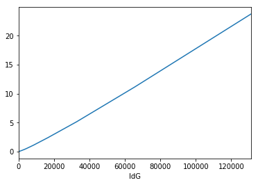
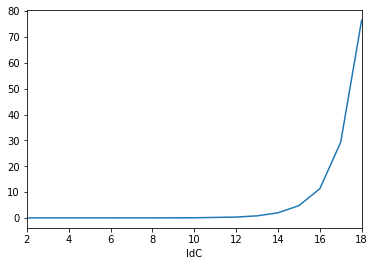

# Poročilo

*Luka Avbreht*

## Opis problema

V nalogi implementiramo algoritem za iskanje najtežje neodvisne množice v kartezičnem produktu drevesa in cikla.

Kot vhodne podatke algoritem sprejme drevo T in pa matriko w, ki predstavlja tabelo tež vozlisc v kartezicnem produktu.

```
w = w[index_v_ciklu][index_v_drevesu]
```

Problem si predstavljamo kot drevo na katerem je vsako vozlisce cikel. Na to vsak cikel oznacimo z nizom enic in nicel, 
ki predstavljajo zaporedje izbranih in neizbranih vozlisc v ciklu, ter s pomocjo njih dolocimo mozne oblike potomcev v 
drevesu.

Alogritem deluje na principu rekurzije. V prvem koraku za deblo maximiziramo vrednost glede na obliko debla, ter funkcijo 
rekurzivno pokliceo na njegovih sinovih, ob temu da se zavedamo, da smo za obliko oceta izbrali dolocen vzorec. V vsakem 
koraku rekurzije tako funkcijo razdelimo na toliko delov, kolikor otrok ima posamezno vozlisce.

V nasem primeru ko imamo opravka z binarnim drevsom z 13 vozlisci, in pa ciklom dolzine 4 tako algoritem deluje na 
priblizno sledeci nacin

```python
>>> T = [[1, 2], [0, 3, 4], [0, 5], [1, 6, 7], [1, 8], [2, 9, 10], [3], [3], [4, 11], [5], [5, 12], [8], [10, 13], [12]]
>>> w = [[6, 7, 3, 6, 8, 7, 5, 4, 5, 8, 7, 6, 2, 5],
...      [3, 6, 2, 5, 8, 5, 9, 1, 5, 8, 3, 7, 3, 3],
...      [8, 3, 2, 5, 7, 9, 4, 3, 7, 8, 0, 9, 3, 8],
...      [5, 7, 3, 7, 2, 9, 4, 2, 6, 0, 9, 1, 5, 0]]
>>> maxCycleTreeIndependentSet(T, w)
(153, [(0, 0), (2, 0), (1, 1), (3, 1), (0, 3), (2, 3), (0, 4), (2, 4), (1, 5), (3, 5), (1, 6), (3, 6), (1, 7), (3, 7), (1, 8), (3, 8), (0, 9), (2, 9), (0, 10), (2, 10), (0, 11), (2, 11), (1, 12), (3, 12), (0, 13), (2, 13)])
```

* Pred samim zacetkom izvajanja programa si pripravimo usmirjeno drevo, ki ga izdelamo iz podanega grafa, to storimo s pomocjo algoritma DFS (vaje5)
* V prvem koraku poklicemo funkcijo na izhodiscu, ter za obliko njegovega oceta nastavimo prazen cikel ("0000")
* Nato maximiziramo vse mozne oblike izhodiscnega cikla kot sina navideznega praznega cikla, ter funkcijo rekurzivno 
poklicemo na poddrevesih z ihodisci v 1 in v 2 ter v nasem primeru ocetom oblike "1010"
* Vsako od izracunanih funkciji shranimo v slovar, kajti lahko se nam zgodi da v prihodnje kdaj poklicemo funkcijo na enakem primeru
* Tako isaknje taksne mnozice rekurzivno nadaljujemo dokler ne pridemo do listov drevesa
* V vsakem koraku s seboj vzamemo tudi podatek o temu katera vozlisca smo izbrali, da le to lahko kasneje vremo kot nas izbrani graf

## Časovna zahtevbnost 

```Legenda
k --- dolzina cikla/ binarnega zapisa vsakega vozlisca (binarne maske)
n --- stevilo povezav v drevesu
m --- stevilo vozlisc v drevesu
T --- 1+sqrt((5)/(2))
```

### Priprava grafa na algoritem

V prvem koraku iz drevesa naredimo usmerjeno drevo s pomocjo algoritma `iterDFS`, ki porabi `O(n) + O(m)*O(1)` časa.

Generiranje binarnih zaporedij, brez sosednjih enic nam vzame za vako zaporedje `O(k)` casa pri cemer je k dolzina ciklov.
Vseh moznih zaporediji 1 in 0 je torej 2^k, nas pa zanimajo le zaporedja, ki so neodvisna (nikoli nista dve enici sosednji). 
Torej nas zanima podmnožica množice z močjo 2^k. Opazimo lahko da je velikost te množice sorazmerna z k-2 im fibonaccijevemu številu.
Z pomocjo izracuna limite lahko tako preverimo, da moc mnozice konvergira proti (1+sqrt((5)/(2)))^k.

### Izracun časovne zahtevnosti

Generiranje binarnih zaporediji : `O((T)^k)`

Sprehod algoritma po drevesu (iskanje najtezje neodvisne mnozice) : `O(T^2k * n)`

Iskanje najtezje neodvisne mnozice deluje tako da se za vsakeego razlicno binarno zaporedje (T^k) sprehodimo po vseh 
povezavah v grafu, ter na vsakem nivoju maximiziramo med vsemi moznimi zaporedji. Rezultate memoriziramo s pomocjo slovarja,
tako da nobenega racuna ne ponavljamo.

Izracun teze vsakega posameznega vozlisca : `O(k * m * T^k)`

Tukaj namrec za vsako vozlisce (m) izracunamo tezo tako da se sprehodimo po binarnem zaporedju dolzine (k) (dolzina cikla), 
ter to na vsakem nivoju v najslabsem primeru naredimo v za vsako mozno binarno zaporedje (T^k). Zaradi memorizacije nikdar tega racuna ne ponavljamo.


Skupna casovna zahtevnost:

``` 
O(T^4k * k * m^2 )
```

## Prostorska zahtevnost

Slovar memorizacije tez: `O(m*T^k)`
V najslabsem primeru bomo na vsakem nivoju izracunali tezo za vsako razlicno zaporedje

Slovar memorizacije rezultatov poddreves: `O(T^k*n)`
Za vsako zaporedje namrec lahko shranimo rezultat za vsako povezavo, ki jo imamo.

Slovar ki ga uporabimo za maximiziranje v rekurziji: `O(T^2k)`
Za vsako mozno binarno zaporedje imamao namrec slovar, ki ima za vrednosti vse mozne sinove.

Skupna prostorska zahtevnost je torej: 
```
O((n+m+T)*T^k)
```

## Tablea časov izvajanja programa pri razlicnih vhoodnih podatkih
 
Za testni primer smo algoritem izvajali na uravnotezenih binarnih drevesih z vedno vecjo globino (polnih binarnih drevesih)

Globina drevesa\dolzina cikla |  3  |  5  |  7  |  9  |  12  |  15   |
----------------------------------|--------------|-------------|-----------------|-----------------|-----------------|-----------------|
     2 |  0.0  |      0.0005  |      0.0035  |      0.0200  |      0.2782  |      4.2648  |  
     3 |   0.0005  |      0.0015  |      0.0075  |      0.0480  |      0.7560  |     11.9549  |  
     4 |   0.0005  |      0.0030  |      0.0185  |      0.1096  |      1.7493  |     28.8186  |  
     5 |   0.0015  |      0.0065  |      0.0395  |      0.2962  |      3.8520  |     67.1365  |  
     6 |   0.0050  |      0.1281  |      0.0840  |      0.5369  |      8.6129  |    141.3120  |  
     7 |   0.0049  |      0.0330  |      0.1711  |      1.0953  |     18.3168  |    299.3329  |  
     8 |   0.0185  |      0.0610  |      0.3618  |      2.8603  |     37.5308  |    636.8147  |  
     9 |   0.0360  |      0.1306  |      0.7645  |      5.0017  |     80.9928  |   1289.9691  |  
     10 |   0.0915  |      0.2942  |      1.7348  |     13.9997  |    192.9435  |  //  |
     
## Grafični prikaz

Spodnji graf prikazuje cas izracuna najtezje mnozice v odvisnost od stevila vozlisc v drevesu pri fiksni dolzini cikla. Opazimo lahko da je ta odvisnost linearna

  


Spodnji graf prikazuje čas potrerben za izracun najtezje mnozice v odvisnosti od dolzine cikla, pri fiksnem drevesu 
(fiksno stevilo vozlisc) 

  