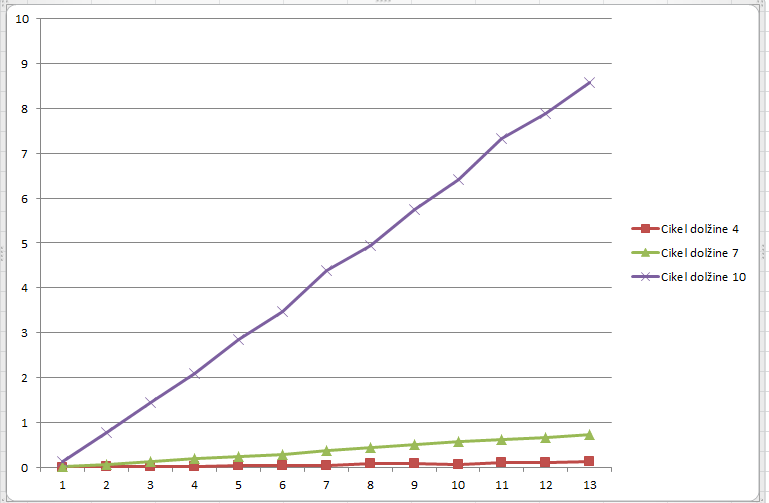

# Poročilo

*Samo Kralj*

# Opis algoritma

Ideja algoritma je, da se osredotočimo na drevo in z dinamičnim programiranjem poiščemo najtežjo množico. Ker pa nimamo samo drevesa ampak imamo
produkt drevesa in cikla, si lahko ta graf predstavljamo kot drevo, ki ima potem na vsakem vozlišču še cikel. Generiramo si bitmaske, ki nam povedo
katera vozlišča v ciklu imamo v naši množici. Iz tega pa sedaj dinamično programiranje na drevesu sledi. In sicer:

Recimo da imamo v korenu drevesa določeno masko B. Če želimo dobiti najtežjo množico s tem, da smo na korenu uporabili masko B, 
moramo poiskati najtežjo množico na vseh sinovih našega korena, pod pogojem da se maska C od sinova ne prekriva z masko B od korena oziroma, 
da je (B AND C = 0).

Tukaj pa vidimo, da se nam velikokrat ponovi problem, ki ga računamo, saj je vsako vozlišče z določeno bitmasko na korenu sam svoj problem
iskanja najtežje množice. Z memoizacijo pridemo do učinkovitega algoritma.

# Analiza časovne zahtevnosti

## Število bitmaskov

Vseh nizov enic in ničel dolžine k je 2^k. Število veljavnih bitmask bo neka podmnožica te množice iz česar lahko predvidevamo, da se bo število
veljavnih bitmaskov povečevalo eksponentno. S pomočjo dinamičnega programiranja izračunamo število veljavnih bitmask. Spodaj je tabela dobljenih vrednosti.

|    2    |   3  |    4    |    5    |    6    |    7    |    8    |    9    |    10   |    11   |    12   |    13   |    14   |    15   |    16   |    17   |    18   |    19   |    20   |    21   |    22   |    23   |    24   |    25   |    26   |    27   |    28   |    29   |
|:-------:|:----:|:-------:|:-------:|:-------:|:-------:|:-------:|:-------:|:-------:|:-------:|:-------:|:-------:|:-------:|:-------:|:-------:|:-------:|:-------:|:-------:|:-------:|:-------:|:-------:|:-------:|:-------:|:-------:|:-------:|:-------:|:-------:|:-------:|
|    3    |   4  |    7    |    11   |    18   |    29   |    47   |    76   |   123   |   199   |   322   |   521   |   843   |   1364  |   2207  |   3571  |   5778  |   9349  |  15127  |  24476  |  39603  |  64079  |  103682 |  167761 |  271443 |  439204 |  710647 | 1149851 |
| 1.33333 | 1.75 | 1.57143 | 1.63636 | 1.61111 | 1.62069 | 1.61702 | 1.61842 | 1.61789 | 1.61809 | 1.61801 | 1.61804 | 1.61803 | 1.61804 | 1.61803 | 1.61803 | 1.61803 | 1.61803 | 1.61803 | 1.61803 | 1.61803 | 1.61803 | 1.61803 | 1.61803 | 1.61803 | 1.61803 | 1.61803 |         |

V prvi vrstici so dolžine ciklov. V drugi število veljavnih bitmaskov za to dolžino, v tretji vrstici pa imamo kvocient števila veljavnih bitmaskov za dolžino i + 1 in dolžino i.
Kvocienti hitro skonvergirajo k vrednosti 1.618033988749895, kar pa je ravno (1 + koren(5))/2. Število bitmaskov bo torej za primerne k enako ((1 + koren(5))/2)^k.

Označimo B = (1 + koren(5))/2. Število veljavnih bitmaskov za določeno dolžino k je torej B^k.

Zanima nas še pričakovana vrednost bitmaskov, ki se ujemajo z dano bitmasko. 

| Dolžina cikla | Število veljavnih bitmask | Povprečno število ujemanj |
|:--:|:----:|:----------:|
|  2 |   3  |   2.33333  |
|  3 |   4  |   3.25000  |
|  4 |   7  |   5.00000  |
|  5 |  11  |   7.36364  |
|  6 |  18  |  11.05556  |
|  7 |  29  |  16.44828  |
|  8 |  47  |  24.57447  |
|  9 |  76  |  36.64474  |
| 10 |  123 |  54.69106  |
| 11 |  199 |  81.59296  |
| 12 |  322 |  121.74845 |
| 13 |  521 |  181.65259 |
| 14 |  843 |  271.04033 |
| 15 | 1364 |  404.40836 |
| 16 | 2207 |  603.40507 |
| 17 | 3571 |  900.31952 |
| 18 | 5778 | 1343.33662 |
| 19 | 9349 | 2004.34667 |

Opazimo lahko, da razmerje povprečnih ujemajočih se bitmaskov in vseh veljavnih bitmaskov pada. Ker nas v glavnem zanimajo dovolj veliki k bomo privzeli
da je povprečno število ujemanj enako 1/4 vseh veljavnih bitmask.

## Prostorska zahtevnost

Za najtežjo množico bo potrebno izračunati najtežje množice vseh poddreves in to za vsako možno bitmasko, ki jo je imel predhodnik. Ker delamo
rekurzivno in si vsako rešitev shranjujemo v slovar, to pomeni, da bomo imeli n*število_bitmaks ključev v slovarju. Pri vsakem ključu imamo za vrednost
najtežjo množico tega podrevesa in sicer kot nabor vozlišča in bitmaske uporabljene na tem vozlišču. Dolžina tega nabora je odvisna od števila vozlišč
v posameznem podrevesu. Bolj kot je drevo razvejano, manjša bo povprečna dolžina nabora. Najslabši primer pa bo takrat, ko bo drevo kar pot. Ker je pot zelo
zdegeneriran primer naključnega drevesa lahko raje ocenimo kakšna bo povprečna dolžina naključnega drevesa in neka groba ocena bo število_vozlišč v drevesu/2.

Prostor, ki ga vzame memoizacija je torej velikosti O(n^2 * število_bitmask) = O(n^2 * B^k). 

Poleg memoizacije pa si naredimo tudi slovar vseh bitmask in njihovih ujemanj. Za fiksno dolžino k je le teh B^k. Za vsak ključ pa imamo v povprečju 
1/4 * B^k vrednosti. Prostorska zahtevnost tega slovarja je potem O(0.25 * B^(2*k)).

Skupna prostorska zahtevnost algoritma je O(n^2 * B^(2*k)).

## Časovna zahtevnost

* V algoritmu najprej generiramo bitmaske. To delamo z naivno metodo in sicer za generiranje bitmask dolžine k, se zapeljemo z zanko do 0 do števila 2^k in
preverimo kateri bitmaski so veljavni. Algoritem bi lahko izboljšali s tem, da bi bitmaske generirali rekurzivno in tako izpustili vse kose števil za katera
recimo binarni zapis vsebuje dve enici na začetku.  Ko generiramo še vse ujemajoče bitmaske nam ta del da časovno zahtevnost O(2^k * B^k). Pri tem predpostavimo,
da je operacija AND dveh števil porabi O(1) časa.

* 

# Meritve časovne zahtevnosti

Za prvo merjenje sem generiral naključna drevesa T s k vozlišči in algoritem uporabil na kartezičnem produktu T x C4, T x C7 in T x C10.

Iz grafa se jasno vidi linearna časovna zahtevnost v številu vozlišč.

 

| Število vozlišč v drevesu | Dolžina cikla: 4 | Dolžina cikla: 7 | Dolžina cikla: 10 |
|:-----:|:---------:|:---------:|:----------:|
| 20  | 0.00302 | 0.04600 | 0.76962  |
| 50  | 0.00801 | 0.12556 | 2.09281  |
| 80  | 0.01456 | 0.20502 | 3.40917  |
| 110 | 0.01949 | 0.28205 | 4.83899  |
| 140 | 0.02400 | 0.37155 | 6.13874  |
| 170 | 0.02956 | 0.44608 | 7.38600  |
| 200 | 0.03353 | 0.51654 | 8.81765  |
| 230 | 0.03906 | 0.60459 | 10.10419 |
| 260 | 0.04445 | 0.68313 | 11.39722 |
| 290 | 0.05051 | 0.78665 | 12.80874 |
| 320 | 0.05556 | 0.84562 | 14.04720 |
| 350 | 0.05952 | 0.91160 | 15.37646 |
| 380 | 0.06452 | 1.02261 | 16.73320 |
| 410 | 0.07003 | 1.06962 | 17.95572 |
| 440 | 0.09457 | 1.14865 | 19.27492 |
| 470 | 0.09802 | 1.24866 | 20.65266 |
| 500 | 0.08546 | 1.32139 | 22.06154 |
| 530 | 0.09096 | 1.41725 | 23.39472 |
| 560 | 0.11052 | 1.50612 | 24.73277 |
| 590 | 0.10155 | 1.57963 | 25.89728 |

Za merjenje zahtevnosti v dolžini cikla pa sem generiral drevesa na 50, 100 in 200 vozliščih in izračunal T x Ck.

Iz grafa lahko preberemo eksponentno rast časa v odvisnosti od dolžine cikla. Za oceno osnove eksponenta pa si poglejmo kvociente sosednjih izmerjenih
časov. 

Poglejmo si nekaj kvocientov v spodnjem delu tabele:

* 470 / 179 = 2.6256
* 224 / 86 = 2.604
* 1023 / 364 = 2.8104
* 364 / 143 = 2.5384
* 143 / 56 = 2.5535
* 179 / 69 = 2.5942
* ...

Lahko sklepamo, da osnova pri eksponentu leži nekje med 2.5 in 2.8.
Iz te tabele prav tako lahko preberemo linearno rast v število vozlišč, če recimo pogledamo določeno vrstico v tabeli.
Čas, ki ga porabimo za drevo z 100 vozlišči je približno 2-krat večji kot čas, ki ga potrebujemo za drevo z 50 vozlišči.

 

| Dolžina cikla | Vozlišč v drevesu: 50 | Vozlišč v drevesu: 100 | Vozlišč v drevesu: 200 |
|:----:|:-----------:|:-----------:|:------------:|
| 2  | 0.00150   | 0.00400   | 0.00700    |
| 3  | 0.00298   | 0.00650   | 0.01350    |
| 4  | 0.00849   | 0.01697   | 0.03304    |
| 5  | 0.02057   | 0.03955   | 0.08206    |
| 6  | 0.04846   | 0.10001   | 0.20460    |
| 7  | 0.14155   | 0.26299   | 0.51406    |
| 8  | 0.31009   | 0.64858   | 1.31067    |
| 9  | 0.79465   | 1.64742   | 3.40593    |
| 10 | 2.03576   | 4.20110   | 8.58516    |
| 11 | 5.26311   | 11.08873  | 22.54611   |
| 12 | 13.35390  | 27.37777  | 56.63912   |
| 13 | 34.37785  | 69.84037  | 143.21437  |
| 14 | 86.10051  | 179.31695 | 363.92527  |
| 15 | 224.50726 | 470.44878 | 1022.81468 |

