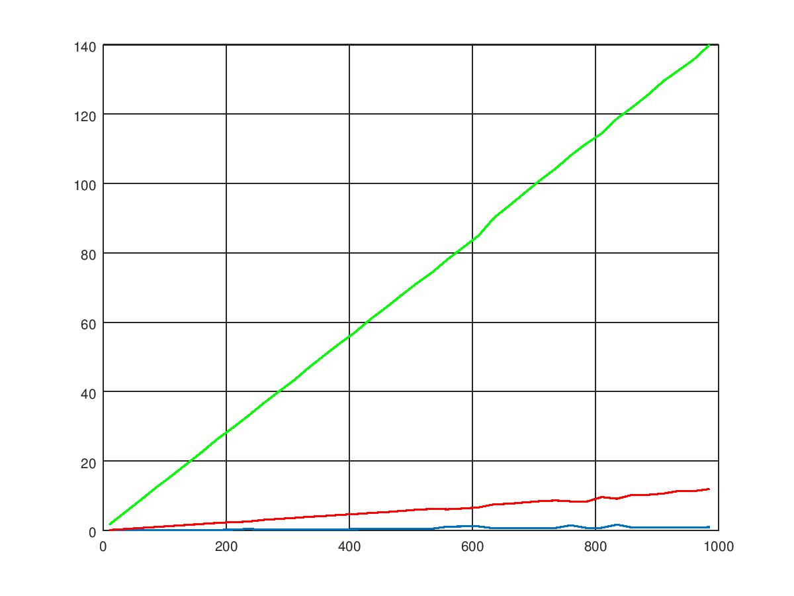
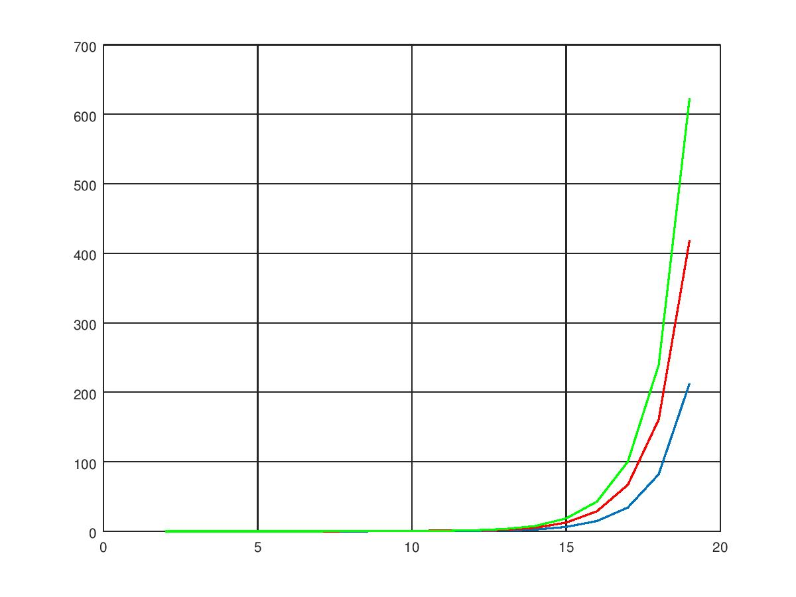

# Poročilo
*Žiga Zupančič*

## Opis algoritma
Algoritem najprej preveri, če dimenzije tabel tež ustrezajo številu vozlišč v drevesu, če je podani graf neusmerjen
ter če je k vsaj 2. Nato ustvarimo vse možne neodvisne podmnožice cikla - podmnožice predstavimo v binarnem zapisu, 
če je na `j`-tem mestu v binarnem zapisu `1`, potem je element v ciklu na mestu `j` v tej podmnožici.
Neodvisne podmnožice cikla so tako tiste, ki nimajo dveh zaporednih enic ter na prvem in zadnjem mestu ni enice.
Dobimo jih tako, da vsako število `0 <= i < 2^k` predstavimo v binarnem zapisu 
in preverimo pogoj neodvisnosti. Nato za vsako od neodvisnih podmnožic cikla shranimo kompatibilne podmnožice (to so 
tiste, ki nimajo enic na istem mestu kot prvotna množica) v slovar. Ustvarimo seznam slovarjev, kamor bomo shranjevali 
maksimalne vrednosti ter uporabljene podmnožice za vsako vozlišče v drevesu - na `i`-tem mestu v seznamu je slovar za 
`i`-to vozlišče v drevesu. Ključi v slovarju so števila, ki v binarnem zapisu predstavljajo neodvisne množice ciklov, 
vrednosti pa največjo težo, ki jo dobimo če uporabimo neodvisno podmnožico cikla, ki je v ključu, pri čemer 
upoštevamo vse sinove tega vozlišča (ki so že izračunani) ter si zapišemo katere neodvisne podmnožice smo izbrali pri 
sinovih, da lahko na koncu rekonstruiramo vsa uporabljena vozlišča.
Z DFS-jem nato obiščemo vsa vozlišča in v postvisitu polnimo prej ustvarjene slovarje - za liste si le shranimo 
vrednosti največje teže za vsako neodvisno podmnožico cikla, za ostale pa pri tem upoštevamo tudi največje teže 
njihovih potomcev.
Nato za koren pogledamo pri kateri neodvisni podmnožici cikla smo dobili največjo vrednost, in to je naš rezultat. 
Sedaj le še preberemo katera vozlišča smo pri tem uporabili, tako da od vrha navzdol pogledamo katere neodvisne 
podmnožice smo uporabili za vsakega sina in to sproti dodajamo v seznam uporabljenih vozlišč.

## Analiza časovne in prostorske zahtevnosti

Funkcija `getSubsets`: Zanka napravi `2^k` korakov in v vsakem koraku `O(k)` operacij, torej je skupna časovna 
zahtevnost enaka `O(k*2^k)`. V seznam spravimo le ustrezne podmnožice, ki jih je `((1+sqrt(5))/2)^k`, saj če označimo z 
`x_k` število neodvisnih množic za cikel dolžine `k`, dobimo rekurzivno formulo: `x_k = x_(k-1) + x_(k-2)` (saj imamo v 
primeru da je na prvem mestu enica, na drugem mestu `0` in tako `x_(k-2)` množic, v primeru da je na prvem mestu `0` pa 
x_(k-1) množic) z začetnima vrednostma: `x_2 = 3` in `x_3 = 4`. Rešitev je zgornja formula. Skupna prostorska 
zahtevnost je torej `O(X^k)`, kjer je `X = (1+sqrt(5))/2`.

Funkcija `getCompatibileSubsets`: Vsaka zanka napravi `X^k` korakov, torej je časovna zahtevnost enaka `O(X^(2k))`. 
Za vsako neodvisno podmnožico si shranimo katere neodvisne podmnožice so kompatibilne z njo, torej če ocenimo navzgor 
dobimo, da je prostorska zahtevnost enaka `O(X^(2k))`. 

Funkcija `getCycleWeight`: Časovna zahtevnost je enaka `O(k)`, saj gremo čez vsak bit v binarnem zapisu števila `subset`
in v primeru da je enak `1` utež na tem mestu prištejemo končni teži.
Prostorska zahtevnost je tako `O(k)`, saj si število spremenimo v binarni zapis.

Funkcija `postivist`: zunanja zanka opravi `X^k` korakov, na vsakem koraku pa izračuna težo trenutne neodvisne 
podmnožice, kar porabi `O(k)` časa ter za vsakega od sinov poišče najtežjo neodvisno podmnožico, ki je kompatibilna 
s trenutno, v `O(X^k)` časa. Skupaj torej porabi `O(X^(2k)*stevilo_sinov(u))` časa. Prostorska zahtevnost je enaka 
`O(stevilo_sinov(u) * X^k)` saj si za vsakega sina zapomnimo katere podmnožice smo uporabili. Vse skupaj shranjujemo v 
že ustvarjen seznam slovarjev, kjer vsak slovar porabi `O(X^k * stevilo_sinov(u))` prostora.

Z DFS-jem gremo nato čez vsa vozlišča v času `O(n)` korakov, na vaskem koraku pa porabimo toliko kot porabi funkcija 
`postvisit` za posamezno vozlišče. Na koncu moramo še najti neodvisno množico korena, pri kateri dobimo največjo 
vrednost. Pri tem porabimo `Ò(X^k)` časa in `O(1)` prostora. Za rekonstrukcijo uporabljenih neodvisnih množic po 
drevesu ter zapis vseh uporabljenih vozlišč pa porabimo `O(n * k)` časa ter `O(n*k)` prostora za zapis vseh 
uporabljenih vozlišč.

## Primerjava dejanskih časov izvajanja

Spodnji graf prikazuje čas izvajanja algoritma v odvisnosti od `n` pri različnih `k`-jih. Pri zeleni krivulje je 
`k = 16`, pri rdeči je `k = 13` ter pri modri `k = 10`.

Opazimo, da so krivulje premice, torej algoritem zadošča zahtevi o polinomskem času izvajanja v `n`. Iz grafa tudi 
vidimo, da z naraščanjem `k`-ja strmina premica hitro narašča. V spodnji tabeli so vrednosti časov pri različnih 
vrednostih `n` in `k`.

| k\n | 10 | 35 |60|85|110|135|160|185|210|235|260|285|310|335|
|---|---|---|---|---|---|---|---|---|---|---|---|---|---|---|
|10|0.01|0.07|0.06|0.08|0.10|0.13|0.16|0.17|0.19|0.45|0.24|0.28|0.28|0.31|
|13|0.13|0.39|0.70|0.98|1.28|1.56|1.86|2.15|2.39|2.53|3.03|3.32|3.60|3.92|
|16|1.69|5.17|8.64|12.2|15.6|19.0|22.5|26.3|29.5|32.9|36.6|39.9|43.3|47.0|

Naslednji graf prikazuje čase izvajanja algoritma v odvisnosti od `k` pri `n = 100` (modra krivulja), `n = 200` 
(rdeča krivulja) ter `n = 300` (zelena krivulja).

Tukaj opazimo, da se čas izvajanja hitro povečuje, ko se veča `k`. Čas izvajanja se veča eksponentno glede na `k`.
